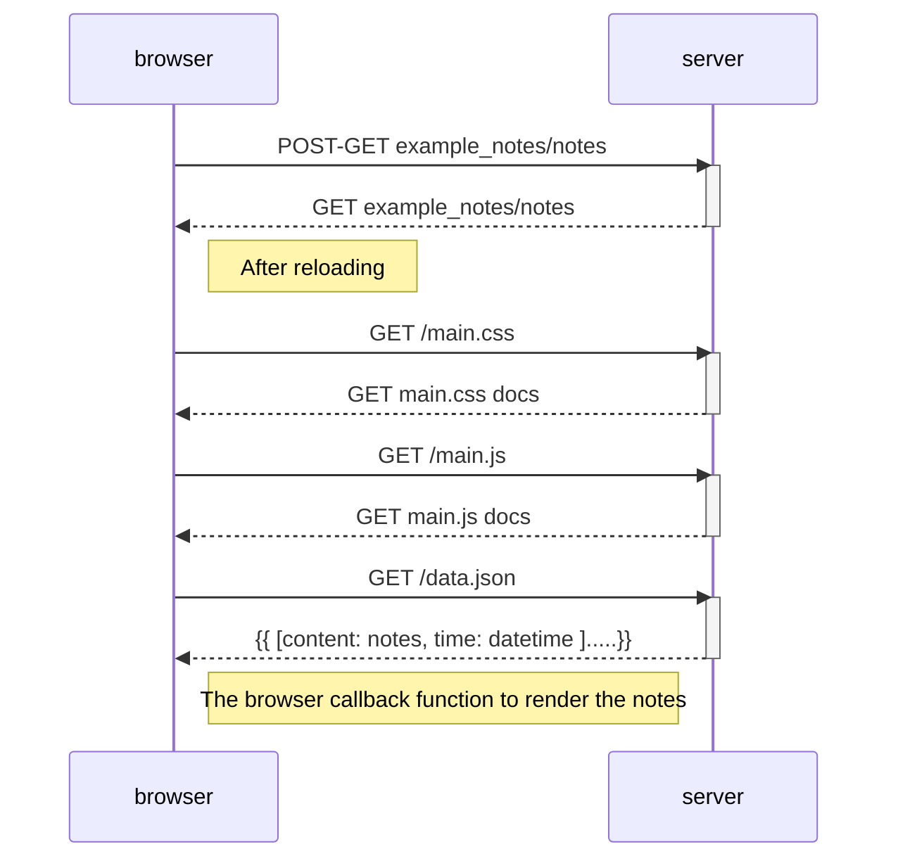

# Sequence Diagram

```mermaid
sequenceDiagram
    participant browser
    participant server

    browser->>server: POST-GET example_notes/notes
    activate server
    server-->>browser: GET example_notes/notes
    deactivate server

    Note right of browser: After reloading

    browser->>server: GET /main.css
    activate server
    server-->>browser: GET    main.css docs
    deactivate server

     browser->>server: GET /main.js
    activate server
    server-->>browser: GET    main.js docs
    deactivate server

     browser->>server: GET /data.json
    activate server
    server-->>browser: {{ [content: notes, time: datetime ].....}}
    deactivate server

    Note right of browser: The browser callback function to render the notes 
    
```
